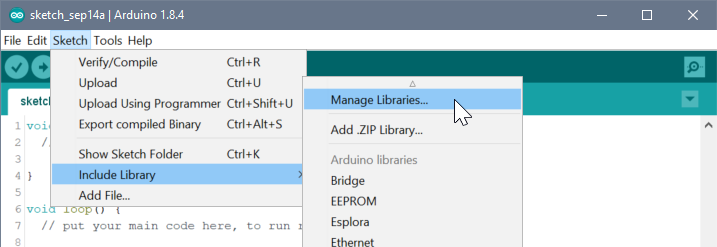
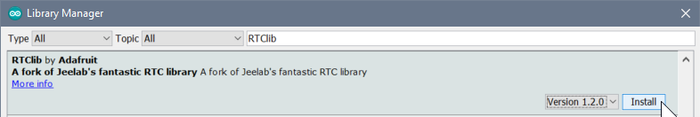
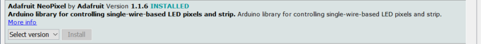
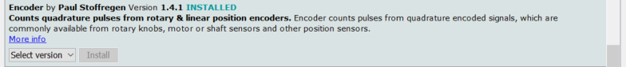
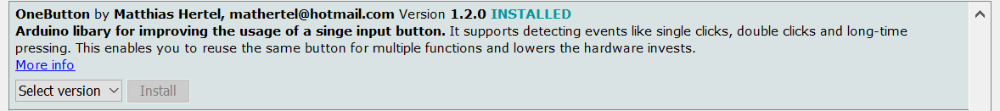
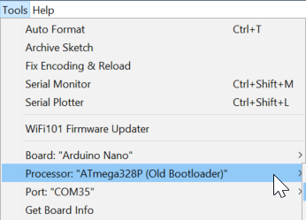

# FHNW Maker Clock - Arduino Software

> Dies ist das Github Repository für die Maker Clock des FHNW Maker Studios.
Hier findest du den Arduino Sketch zum Anpassen und Programmieren deiner MakerClock.
> Weitere Informationen zur Maker Clock findest du auf der Webseite des FHNW Maker Studios: 

**[makerstudio.fhnw.ch](https://makerstudio.fhnw.ch)**

[MakerClock Artikel](https://web.fhnw.ch/plattformen/makerstudio/index.php/makerclock-article/)

## Installation

### 1. Arduino IDE

Damit du den Code auf deinem Computer kompilieren kannst, musst du zuerst die Arduino IDE Software herunterladen.
Die Arduino IDE kannst du von der offiziellen Arduino Website herunterladen (Windows / Mac OS X / Linux).

**[www.arduino.cc](https://www.arduino.cc/en/Main/Software)**

### 2. Bibliotheken (Libraries)

Der Code benötigt weitere Libraries um funktionieren zu können. Folgende Libraries musst du in der Arduino IDE herunterladen.
Öffne dazu den `Library Manager`.

#### 2.1 RTCLib

Gib im Suchfeld den Begriff "_RTCLib_" ein und installiere die oben aufgeführte Library.

#### 2.2 Adafruit_NeoPixel

Gib im Suchfeld den Begriff "_NeoPixel_" ein und installiere die oben aufgeführte Library.

#### 2.3 Encoder

Gib im Suchfeld den Begriff "_Encoder_" ein und installiere die oben aufgeführte Library. (Hier muss man ein bisschen scrollen)

#### 2.4 OneButton

Gib im Suchfeld den Begriff "_OneButton_" ein und installiere die oben aufgeführte Library.

---

## 3. Programmierung

Schliesse deine Maker Clock mit dem miniUSB Kabel an deinem Computer an. Danach musst du die obigen Einstellungen in der Arduino IDE treffen.

- `Board: "Arduino Nano"`
- `Processor: ATmega328P (Old Bootloader)`
- `Port: ` (der Arduino Port) *

### 3.1 Mögliche Fehlerquellen

| Problem | Mögliche Lösung |
|---------|-----------------|
| * Falscher Port ausgewählt | Den richtigen Port identifizieren z.B. durch ausziehen und wieder einstecken des USB Kabels und vergleichen welcher Port neu hinzukommt |
| Fehlende Treiber | Geräte Manager öffnen und Treiber aktualisieren |
| Falscher Arduino ausgewählt | Je nach dem musst du den `ATmega328P` oder den `ATmega328P (Old Bootloader)` auswählen |
| USB Problem bei Mac OS X | Hier kann ein USB Hub zwischen den Mac und den Arduino helfen |

---

## Anpassungsmöglichkeiten

Im unteren Teil des Codes (ca. ab Zeile 190)  sind verschiednene Funktionen die "Animation" im Namen haben. Diese sind besonders gut geeignet eigene LED Muster zu programmieren.

Die Maker Clock kann auch in eine Kuckucksuhr umfunktioniert werden. 
So kann man zu jeder vollen Stunde eine Animation machen oder die Zeigerfarbe ändern.

---

> Erstellt von Simon Burkhardt ([mnemocron](https://github.com/mnemocron)) für das [FHNW MakerStudio](https://github.com/fhnw-makerstudio)
